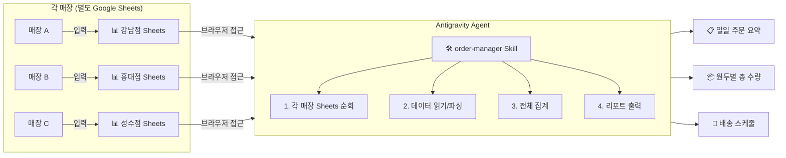

# 원두 주문 관리 자동화 시스템 설계 (v5 — 3-Agent 토론 반영)

원두 생산/배송 관리자가 Google Sheets에 입력된 매장 주문 데이터를 Antigravity 에이전트로 자동 정리하는 시스템입니다.

> [!NOTE]
> **v5 변경사항**: v4 설계에 Modeling Lead × Product Lead × Tech Lead 3자 토론(10라운드) 결과를 반영
> - 코드 실행 분리, 프롬프트 엔지니어링, 사전 헬스체크, 보안 가이드, 출력 형식 고정, 에이전트 설정 변경 지원
> - 관련 토론: [`three_agent_debate.md`](file:///Users/sangwook/Documents/workspace/repo/antigravity_test/blackup_bean_order/docs/debates/three_agent_debate.md)

## 확정 사항

| # | 항목 | 결정 |
|---|------|------|
| 1 | 데이터 형식 | Google Sheets |
| 2 | 데이터 컬럼 | 13개 컬럼 (필수 7 + 선택 6, 단가/금액 제외) |
| 3 | Sheets 구성 | **매장별 별도 Sheets** |
| 4 | 인증 방식 | 브라우저 기반 (별도 API 인증 불필요) |
| 5 | 처리 방식 | 에이전트가 직접 처리 (스크립트 0개) |
| 6 | 리포트 | 일일 요약 + 원두별 합산 + 배송 스케줄 (**전체**) |
| 7 | 교차검증 | 스킬 내 자체 검증 (15개 항목 — 아래 상세) |
| 8 | 개인정보 | 리포트에 주문자·연락처 **미포함** (원본 Sheets에서만 확인) |
| 9 | 경고 체계 | 3단계 분류 (`❌ CRITICAL` / `⚠️ WARNING` / `ℹ️ INFO`) |
| 10 | 코드 실행 분리 | 산술 연산은 코드로, 데이터 해석·리포트 문장은 LLM으로 |
| 11 | 보안 | 에이전트는 **읽기 전용** — 원본 Sheets 쓰기 금지, 전용 계정 권장 |
| 12 | 사전 헬스체크 | 데이터 수집 전 settings/Sheets 접근/코드 매핑 사전 검증 |

---

## 시스템 아키텍처



## 데이터 흐름

| 단계 | 누가 | 무엇을 | 어떻게 |
|------|------|--------|--------|
| ① 주문 입력 | 매장 직원 | Google Sheets에 주문 입력 | 브라우저/모바일에서 직접 |
| ② 데이터 접근 | 에이전트 | Sheets URL을 브라우저로 열기 | Antigravity 브라우저 도구 |
| ③ 파싱/집계 | 에이전트 | 데이터 읽고 분석 | SKILL.md 가이드에 따라 |
| ④ 리포트 출력 | 에이전트 | 집계 결과를 정리해서 출력 | Markdown 리포트 |

## 데이터 스펙 (확정)

### 컬럼 정의

| # | 컬럼명 | 필수 | 타입 | 예시 | 리포트 출력 |
|---|--------|------|------|------|------------|
| 1 | 주문일 | ✅ | DATE | `2026-02-15` | ✅ |
| 2 | 매장코드 | ✅ | STRING | `GN` | ✅ |
| 3 | 매장명 | ✅ | STRING | `강남점` | ✅ |
| 4 | 원두코드 | ✅ | STRING | `ETH-YRG` | ✅ |
| 5 | 원두명 | ✅ | STRING | `에티오피아 예가체프` | ✅ |
| 6 | 수량(kg) | ✅ | NUMBER | `5` | ✅ |
| 7 | 배송희망일 | ✅ | DATE | `2026-02-17` | ✅ |
| 8 | 로스팅단계 | ⬜ | STRING | `미디엄` / `다크` / `라이트` | ✅ |
| 9 | 분쇄여부 | ⬜ | STRING | `홀빈` / `분쇄` | ✅ |
| 10 | 긴급여부 | ⬜ | STRING | `Y` / `N` | ✅ |
| 11 | 비고 | ⬜ | STRING | `포장 2.5kg씩 분리` | ✅ |
| 12 | 주문자 | ⬜ | STRING | `김철수` | ❌ **미출력** |
| 13 | 연락처 | ⬜ | STRING | `010-1234-5678` | ❌ **미출력** |

> [!IMPORTANT]
> **개인정보 보호 원칙** (Debate R7): 주문자·연락처는 에이전트가 읽되 리포트에 출력하지 않음. 관리자가 필요 시 원본 Sheets에서 직접 확인.

---

## Proposed Changes

### 프로젝트 디렉토리 구조

> **프로젝트 루트**: `repo/antigravity_test/blackup_bean_order/`

```
blackup_bean_order/
├── .agent/skills/order-manager/
│   └── SKILL.md              # Skill 정의 (에이전트 가이드)
├── config/
│   └── settings.yaml          # Sheets URL, 매장/원두 마스터 목록
├── templates/
│   └── daily_report.md        # 리포트 출력 템플릿
├── examples/
│   ├── sample_sheet_data.md   # 샘플 데이터 참고용
│   ├── test_normal.md         # [v4 NEW] 정상 시나리오 테스트
│   ├── test_warnings.md       # [v4 NEW] 경고 시나리오 테스트
│   └── test_edge_cases.md     # [v4 NEW] 엣지 케이스 테스트
└── docs/
    ├── specs/                 # 설계 스펙 문서
    ├── reviews/               # 설계 비판/리뷰
    └── debates/               # 토론 기록
```

> [!TIP]
> 스크립트 0개! 모든 로직은 `SKILL.md`에 가이드로 작성하고 에이전트가 실행합니다.

---

### SKILL.md (Core)

#### [NEW] [SKILL.md](file:///Users/sangwook/Documents/workspace/repo/antigravity_test/blackup_bean_order/.agent/skills/order-manager/SKILL.md)

에이전트의 전체 동작을 안내하는 스킬 정의 파일.

**에이전트 역할 정의 (3-Agent R4):**
```
너는 블랙업 커피 로스터스의 원두 주문 관리 에이전트다.
정확하고 일관된 리포트 생성이 핵심 임무다.
데이터 해석이 불확실하면 추측하지 말고 해당 행을 건너뛰고 ⚠️ 경고를 표시하라.
```

**에이전트 실행 가이드:**
0. **[NEW] 사전 헬스체크** (3-Agent R8): settings.yaml 구문 검증 → 모든 매장 Sheets URL 접근 확인 → 매장코드·원두코드 매핑 확인. 실패 시 **즉시 중단** + 원인 안내
1. `settings.yaml` 로드 및 **구문 검증** (YAML 파싱 실패 시 사용자 친화적 에러 메시지)
2. 브라우저 도구로 각 매장 Sheets **순차 처리** — 매장 1 읽기 → 중간 집계 → 매장 2 읽기 → 중간 집계 업데이트 → ... → 최종 합산 (3-Agent R3)
3. 날짜/매장/원두별 집계 — **산술 연산은 코드 실행(Code Interpreter)으로 수행** (3-Agent R1). 데이터 해석·리포트 문장 생성만 LLM 담당
4. 리포트 템플릿에 맞춰 결과 출력 — `templates/daily_report.md`의 구조를 **절대 변경하지 않고** 값만 채움 (3-Agent R6). 원두명 한/영 병기, **주문자·연락처 미포함**
5. **교차검증**: 원본 데이터와 리포트 결과 비교 (15개 항목, 아래 상세)
6. `enable_cost_report: true`인 경우 **예상 원가 섹션** 추가 출력 (관리자 전용)
7. 리포트 하단에 **실행 메타데이터** 출력 (실행 시각, 처리한 매장 목록, 소요 시간, 경고 건수 요약)

> [!TIP]
> 주문 마감 시간 이후(17시 권장) 실행하면 데이터 안정성이 높아집니다.

**실패 시 대응 가이드 (Debate R1):**
- 매장 Sheets 순회 중 오류 발생 시, 어디까지 처리했는지 사용자에게 안내
- 실패한 매장부터 재시도하는 방법 명시
- 부분 데이터로 리포트를 생성하지 **않음** — 전체 성공 후 출력

**엣지 케이스 처리 가이드 (Debate R12):**

| 상황 | 처리 방식 | 경고 등급 |
|------|----------|----------|
| 빈 시트 (주문 0건) | "해당 매장 주문 없음"으로 정상 처리 | `ℹ️ INFO` |
| 수량 = 0kg | 주문 접수하되 경고 | `⚠️ WARNING` "수량 0 — 의도된 주문인지 확인" |
| 수량 > `max_order_kg` | 주문 접수하되 경고 | `⚠️ WARNING` "이상 수량 — 오타 확인 필요" |
| 시트 접근 불가 | 해당 매장만 스킵, 나머지 정상 처리 | `❌ CRITICAL` "시트 접근 불가 — 공유 설정 확인" |
| YAML 구문 오류 | 실행 중단, 에러 위치 안내 | `❌ CRITICAL` |

**복수일 일괄 처리 가이드 (Debate R10):**
- "2/13~2/15 주문 정리해줘" 같은 기간 지정 지원
- 복수일 처리 시 **일자별 분리 출력** (기본) 또는 **합산 출력** (요청 시)

**가드레일 규칙 (3-Agent R4):**
- 데이터 해석이 불확실하면 해당 행을 **건너뛰기** + `⚠️ 해석 불가` 경고 표시
- 추측으로 리포트를 채우지 않음 — 확실한 데이터만 사용
- 숫자는 소수점 첫째 자리까지, 단위(kg) 항상 표기

**보안 가이드 (3-Agent R5):**
- **에이전트용 전용 Google 계정** 사용 권장 (관리자 개인 계정 X)
- 에이전트는 **읽기 전용** — 어떤 경우에도 원본 Sheets에 쓰기 금지
- settings.yaml의 `read_only: true` 플래그로 원칙 명시

**에이전트를 통한 설정 변경 (3-Agent R7):**
- 관리자가 "에티오피아 하라를 원두 목록에 추가해줘"라고 요청 시 에이전트가 settings.yaml 변경 가능
- 변경 전 **Dry-run (변경 미리보기)** 출력 필수
- 변경 시 **이전 버전 자동 백업** (`settings.yaml.bak`)
- 설정 변경은 **관리자 명시적 요청 시에만** — 주문 처리 중 자동 변경 금지

**운영 가이드 (SKILL.md 포함 사항):**
- 정기 주문 매장은 시트에 '기본 주문' 탭을 만들어 활용 권장
- Google Sheets 데이터 유효성 규칙 설정 안내 (날짜/수량 형식 제한)
- 리포트 파일 네이밍: `daily_report_YYYY-MM-DD_HHMM.md` (시각 포함, 덮어쓰기 방지)
- 리포트 폴더 구조: `reports/YYYY-MM/daily_report_YYYY-MM-DD_HHMM.md`
- YAML 편집 예시와 주의사항
- **개인정보 미포함 원칙** 안내
- **예상 운영 비용** 안내 (월 추정치)
- **원가 업데이트 주기**: 월 1회 시세 확인 후 cost_per_kg 업데이트 권장
- **테스트 데이터로 검증하는 방법** (`examples/test_*.md` 활용)
- **대규모 처리 가이드**: 8개 매장 이상 시 2개 그룹으로 분할 처리 권장

---

### 경고 3단계 분류 체계 (Debate R6) {#alert-levels}

모든 검증 경고는 심각도별 3단계로 분류하고, 각 경고에 **권장 조치(Suggested Action)**를 반드시 포함한다:

| 등급 | 아이콘 | 의미 | 예시 |
|------|--------|------|------|
| **CRITICAL** | `❌` | 데이터 오류, 즉시 확인 필요 | "시트 접근 불가", "YAML 구문 오류" |
| **WARNING** | `⚠️` | 판단 필요, 관리자 확인 권장 | "납기 촉박 → 매장에 배송일 조율 필요" |
| **INFO** | `ℹ️` | 참고 정보 | "강남점 주문 없음", "미등록 원두 확인" |

---

### 교차검증 항목 (15개)

| # | 검증 항목 | 등급 | 설명 | 권장 조치 |
|---|-----------|------|------|----------|
| 1 | 총 주문 건수 일치 | `❌` | 원본 건수 ≠ 리포트 건수 | 재실행 필요 |
| 2 | 원두별 수량 합계 일치 | `❌` | 원두별 합계 ≠ 전체 합계 | 재실행 필요 |
| 3 | 매장 수 일치 | `❌` | 처리 매장 수 ≠ 등록 매장 수 | 누락 매장 시트 확인 |
| 4 | 중복 주문 감지 | `⚠️` | 동일 매장+원두+날짜 중복 행 | 매장에 확인 연락 |
| 5 | 재고 부족 경고 | `⚠️` | 주문량 > 가용 재고 | 생두 발주 또는 매장 수량 조율 |
| 6 | 납기 촉박 경고 | `⚠️` | 배송희망일 - 주문일 < min_lead_days | 매장에 배송일 조율 연락 |
| 7 | 미등록 원두 감지 | `ℹ️` | beans 목록에 없는 원두 코드 | 관리자가 settings에 추가 여부 결정 |
| 8 | 날짜 형식 검증 | `⚠️` | YYYY-MM-DD 아닌 날짜 | 해당 매장에 형식 수정 요청 |
| 9 | 수량 숫자 검증 | `⚠️` | 수량이 양의 숫자가 아님 | 해당 행 확인, 수정 후 재실행 |
| 10 | 필수 컬럼 누락 검사 | `❌` | 필수 7개 컬럼 누락 | 해당 매장에 보충 요청 |
| 11 | 원두코드-원두명 매핑 일치 | `ℹ️` | settings 매핑과 불일치 | settings 또는 시트 확인 |
| 12 | 이상 수량 감지 | `⚠️` | 수량 > `max_order_kg` | 오타 확인, 매장에 확인 연락 |
| 13 | 수량 0 감지 | `⚠️` | 수량 = 0 | 의도된 주문인지 매장에 확인 |
| 14 | 시트 접근 불가 | `❌` | Sheets 열기 실패 | 공유 설정·URL 확인 |
| 15 | **리포트 형식 검증** | `ℹ️` | 컬럼명·섹션 순서가 템플릿과 불일치 | 템플릿 확인 후 재실행 |

---

### 설정 파일

#### [NEW] [settings.yaml](file:///Users/sangwook/Documents/workspace/repo/antigravity_test/blackup_bean_order/config/settings.yaml)

```yaml
# [v4 NEW] 로스터리 정보 (멀티테넌시 변수화 기반)
roastery:
  name: "블랙업 커피 로스터스"
  code: "BLACKUP"

# 매장별 별도 Google Sheets
stores:
  - name: "강남점"
    code: "GN"
    sheet_url: "https://docs.google.com/spreadsheets/d/SHEET_ID_GN"
    zone: "강남권"
  - name: "홍대점"
    code: "HD"
    sheet_url: "https://docs.google.com/spreadsheets/d/SHEET_ID_HD"
    zone: "마포권"
  - name: "성수점"
    code: "SS"
    sheet_url: "https://docs.google.com/spreadsheets/d/SHEET_ID_SS"
    zone: "성동권"

beans:
  - name: "에티오피아 예가체프"
    name_en: "Ethiopia Yirgacheffe"
    code: "ETH-YRG"
    stock_kg: 30
    cost_per_kg: 25000
  - name: "콜롬비아 수프리모"
    name_en: "Colombia Supremo"
    code: "COL-SUP"
    stock_kg: 15
    cost_per_kg: 22000
  - name: "브라질 산토스"
    name_en: "Brazil Santos"
    code: "BRA-SAN"
    stock_kg: 25
    cost_per_kg: 18000

# 로스팅 프로파일 매핑 (매장 입력 → 내부 코드)
roasting_profiles:
  라이트: "L-STD"
  미디엄: "M-STD"
  다크: "D-STD"

min_lead_days: 2          # 최소 로스팅 리드타임 (일)
max_order_kg: 50          # 단일 주문 이상치 임계값 (kg)
read_only: true           # [v5 NEW] 에이전트 읽기 전용 원칙 플래그

enable_cost_report: false # 원가 리포트 활성화 여부 (관리자 전용)

reports:
  - daily_summary         # 일일 주문 요약
  - bean_totals           # 원두별 총 수량 합산
  - delivery_schedule     # 배송 스케줄
```

---

### 리포트 출력 예시

> 파일명 규칙: `daily_report_YYYY-MM-DD_HHMM.md` (동일 날짜 재실행 시 이전 리포트 보존)

```markdown
# 📋 일일 주문 요약 (2026-02-15)
> 🏭 블랙업 커피 로스터스 (BLACKUP)

## 원두별 총 주문량
| 원두명                                          | 코드     | 로스팅  | 총 수량(kg) | 재고(kg) | 과부족  | 매장 수 |
|-------------------------------------------------|----------|--------|------------|---------|--------|--------|
| 에티오피아 예가체프 (Ethiopia Yirgacheffe)          | ETH-YRG  | 미디엄  | 8          | 30      | +22    | 2      |
| 에티오피아 예가체프 (Ethiopia Yirgacheffe)          | ETH-YRG  | 라이트  | 3          | (합산)   | -      | 1      |
| 콜롬비아 수프리모 (Colombia Supremo)               | COL-SUP  | 다크    | 8          | 15      | +7     | 2      |
| 브라질 산토스 (Brazil Santos)                      | BRA-SAN  | 미디엄  | 22         | 25      | +3     | 4      |

## 매장별 주문 내역
### 강남점 (GN) — 강남권
- 에티오피아 예가체프: 5kg (미디엄 [M-STD], 홀빈)
- 콜롬비아 수프리모: 3kg (다크 [D-STD], 분쇄) ⚠️ 긴급

### 홍대점 (HD) — 마포권
- 브라질 산토스: 10kg (라이트 [L-STD], 홀빈)

## 배송 일정
| 배송일      | 구역   | 매장   | 원두             | 수량  | 비고 |
|------------|--------|--------|-----------------|-------|------|
| 2026-02-17 | 강남권 | 강남점 | 에티오피아 예가체프 | 5kg   |      |
| 2026-02-17 | 강남권 | 강남점 | 콜롬비아 수프리모  | 3kg   | 긴급 |
| 2026-02-18 | 마포권 | 홍대점 | 브라질 산토스     | 10kg  |      |

## ✅ 검증 결과
| # | 항목 | 등급 | 결과 | 권장 조치 |
|---|------|------|------|----------|
| 1 | 총 주문 건수 | - | ✅ 3건 일치 | - |
| 2 | 총 수량 합계 | - | ✅ 18kg 일치 | - |
| 3 | 매장 수 | - | ✅ 2개 일치 | - |
| 4 | 중복 주문 | - | ✅ 중복 없음 | - |
| 5 | 재고 부족 | - | ✅ 부족 없음 | - |
| 6 | 납기 촉박 | ⚠️ | 강남점 COL-SUP (1일 후) | 매장에 배송일 조율 연락 |
| 7 | 미등록 원두 | - | ✅ 미등록 없음 | - |
| 8 | 날짜 형식 | - | ✅ 3건 정상 | - |
| 9 | 수량 숫자 | - | ✅ 3건 정상 | - |
| 10 | 필수 컬럼 | - | ✅ 누락 없음 | - |
| 11 | 원두코드 매핑 | - | ✅ 일치 | - |
| 12 | 이상 수량 | - | ✅ 정상 범위 | - |
| 13 | 수량 0 | - | ✅ 해당 없음 | - |
| 14 | 시트 접근 | - | ✅ 전체 접근 성공 | - |
| 15 | 리포트 형식 | - | ✅ 템플릿 일치 | - |

---
📌 실행 메타데이터: 2026-02-15 17:30 | 처리 매장: 강남점, 홍대점 | 소요 시간: 약 3분 | 경고: ⚠️ 1건, ℹ️ 0건
```

---

## v1.5 로드맵 (단기)

| # | 항목 | 출처 |
|---|------|------|
| 1 | 리포트를 공유 Google Docs에 자동 기록 → 매장이 URL로 조회 가능 | 기존 |
| 2 | 비상용 간이 집계 스크립트 (CSV → 합산) — DR 대비 | TL-PL R5 |
| 3 | settings.yaml 구문 검증 도구 (파싱 실패 시 명확한 오류 메시지) | TL-PL R4 |
| 4 | 리포트 섹션별 on/off 옵션 (`report_sections` 설정) | TL-PL R8 |
| 5 | 에이전트 실행 비용 투명성 (토큰 사용량 추정 표시) | TL-PL R11 |
| 6 | 리포트 데이터 CSV 부출력 (수요 예측용 데이터 축적) | 3-Agent R9 |
| 7 | 매장별 처리 시간 메타데이터 | 3-Agent R3 |
| 8 | 주간 품질 요약 자동 생성 (경고 건수 추이) | 3-Agent R2 |

## v2 로드맵 (향후 고려)

| # | 항목 | 출처 |
|---|------|------|
| 1 | 주간/월간 트렌드 분석 (수요 변화 감지) | 기존 |
| 2 | 월간 요약 리포트 | 기존 |
| 3 | 리포트 인덱스/검색 기능 | 기존 |
| 4 | 리포트 자동 공유 (카카오톡/Slack/이메일 알림) | 기존 |
| 5 | 매장 접수 확인 피드백 | 기존 |
| 6 | 배송 루트 최적화 | 기존 |
| 7 | Google Sheets API + 서비스 계정 (최소 권한) | TL-PL R2, 3-Agent R5 |
| 8 | 독립 교차검증 모듈 (에이전트 외부 검증) | TL-PL R3 |
| 9 | 실행 이력 로그 자동 생성 (`logs/YYYY-MM-DD_execution.log`) | TL-PL R3 |
| 10 | 정기 자동 실행(opt-in) + 미실행 시 리마인더 알림 | TL-PL R10 |
| 11 | 운영 히스토리 대시보드 | TL-PL R14 |
| 12 | 멀티테넌시 아키텍처 | TL-PL R9 |
| 13 | 수요 예측 모델 (과거 주문 CSV 기반 다음 주 예상 수요) | 3-Agent R9 |
| 14 | 정량적 교차검증 평가 (Precision/Recall, Ground Truth) | 3-Agent R2 |

## Verification Plan

### 골든 테스트 셋 (Debate R15)

각 시나리오에 **입력 데이터 + 기대 출력**을 정의하여 검증:

| # | 파일 | 시나리오 | 검증 대상 |
|---|------|---------|----------|
| 1 | `examples/test_normal.md` | 3매장 5건 정상 주문 | 집계 정확성, 리포트 형식 |
| 2 | `examples/test_warnings.md` | 재고 부족 + 납기 촉박 + 미등록 원두 | 경고 발생 + 권장 조치 표시 |
| 3 | `examples/test_edge_cases.md` | 빈 시트 + 0kg + 이상 수량 + 접근 불가 | 엣지 케이스 정상 처리 |

**검증 기준**: 전체 텍스트 일치가 아닌, **핵심 수치** (총 건수, 총 수량, 경고 건수) 비교

### 자동 테스트
1. **브라우저 접근 테스트**: 실제 Google Sheets URL을 브라우저 도구로 열어 데이터 읽기 확인
2. **집계 정확성**: 골든 테스트 셋의 입력 데이터로 핵심 수치 일치 검증
3. **리포트 형식**: 경고 3단계 분류, 메타데이터, 개인정보 미포함 확인
4. **엣지 케이스**: 빈 시트·0kg·이상 수량·접근 불가 시나리오 처리 확인

### 수동 검증 (UAT)
1. **Google Sheets에 테스트 데이터 입력** → "오늘 주문 정리해줘" 실행
2. **비개발자 테스트**: 실제 매장 직원이 시트에 입력하고 리포트 확인
3. v1 출시 전 **UAT 1회** 필수 수행

---

## 관련 문서

| 유형 | 문서 | 설명 |
|------|------|------|
| 리뷰 | [`design_review.md`](file:///Users/sangwook/Documents/workspace/repo/antigravity_test/blackup_bean_order/docs/reviews/design_review.md) | 로스터 관점 설계 비판 (5 Rounds) |
| 토론 | [`multi_persona_debate.md`](file:///Users/sangwook/Documents/workspace/repo/antigravity_test/blackup_bean_order/docs/debates/multi_persona_debate.md) | 다중 페르소나 설계 토론 (10 Rounds) |
| 토론 | [`tech_vs_product_debate.md`](file:///Users/sangwook/Documents/workspace/repo/antigravity_test/blackup_bean_order/docs/debates/tech_vs_product_debate.md) | Tech Lead vs Product Lead (15 Rounds) |
| 토론 | [`three_agent_debate.md`](file:///Users/sangwook/Documents/workspace/repo/antigravity_test/blackup_bean_order/docs/debates/three_agent_debate.md) | ML × Product × Tech 3자 토론 (10 Rounds) |
