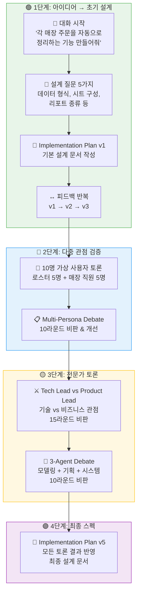
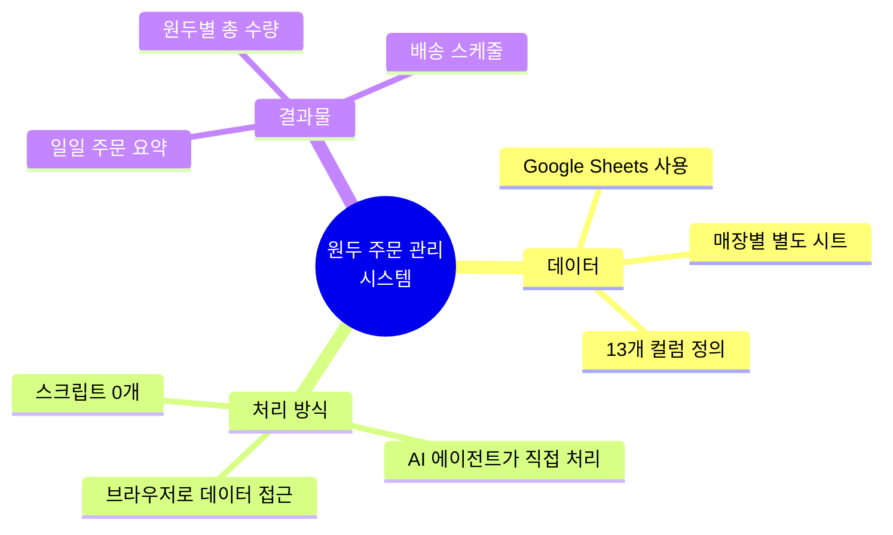
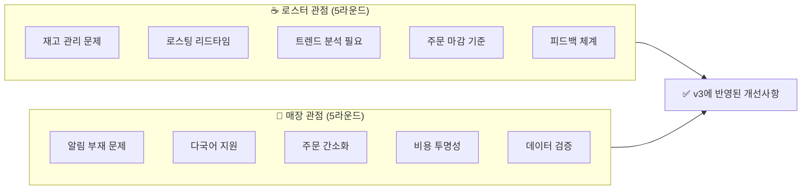
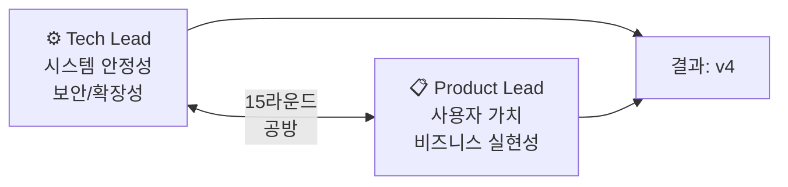
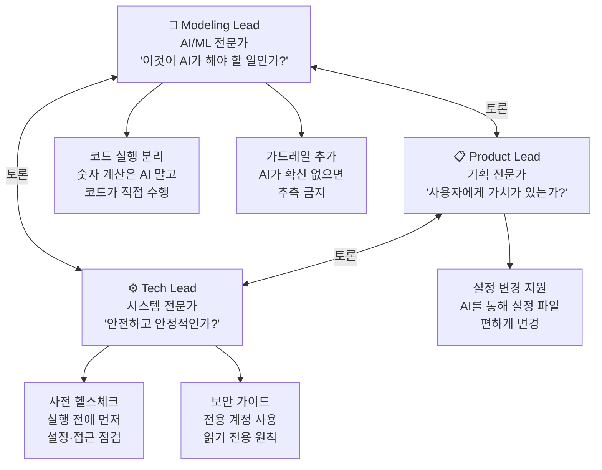
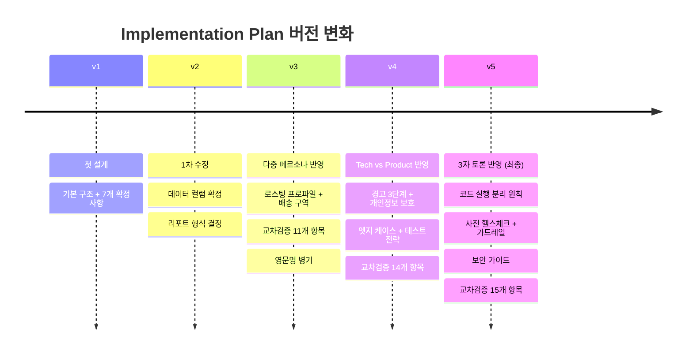
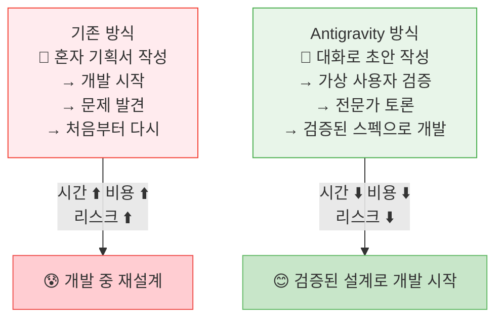

# 📘 Antigravity로 서비스 스펙 만들기 — 전체 과정 안내서

> **대상 독자**: 비개발자 (기획자, 로스터리 운영자, 사업 담당자)
> **목적**: Antigravity AI 도구를 설치한 이후, "원두 주문 관리 시스템"의 설계 문서가 어떤 과정을 거쳐 완성되었는지를 설명합니다.

---

## 전체 과정 한눈에 보기



---

## 🟢 1단계: 아이디어에서 초기 설계까지

### 무엇을 했나?

| 순서 | 한 일 | 결과물 |
|------|-------|--------|
| 1 | "각 매장에서 들어오는 원두 주문을 자동으로 정리하고 싶어" 라고 Antigravity에 요청 | 대화 시작 |
| 2 | Antigravity가 5가지 핵심 질문을 던짐 | 데이터 포맷, 시트 구성 등 결정 |
| 3 | 대화를 통해 핵심 결정 7가지 확정 | Implementation Plan v1 작성 |
| 4 | 피드백을 주고받으며 3차례 수정 | v1 → v2 → v3 |

### 핵심 결정 사항



### 쉽게 비유하면

> 🍳 **요리에 비유**: "오늘 저녁 뭐 먹지?" (아이디어) → "냉장고에 뭐 있지?" (데이터 점검) → "레시피 초안 작성" (v1) → "가족 입맛 반영해서 수정" (v2, v3)

---

## 🔵 2단계: 가상 사용자 10명과 함께 검증

### 무엇을 했나?

초기 설계(v3)를 **실제 사용할 사람들의 관점**에서 검증했습니다. Antigravity에 "로스터 5명, 매장 직원 5명의 역할로 이 설계를 비판해줘"라고 요청했습니다.



### 이 단계에서 바뀐 것들

| # | 발견된 문제 | 개선 내용 |
|---|-----------|----------|
| 1 | 로스팅 프로파일이 매장마다 다름 | 로스팅단계별 별도 집계 추가 |
| 2 | 영문 원두명이 없어 소통 어려움 | 원두명 한/영 병기 |
| 3 | 소량 주문 합배송 기준 없음 | 배송 구역(zone) 개념 도입 |
| 4 | 원가 정보 접근 우려 | `enable_cost_report` 토글 추가 |
| 5 | 입력 형식 오류 감지 불가 | 교차검증 11개 항목 추가 |

### 관련 문서
📄 [multi_persona_debate.md](file:///Users/sangwook/Documents/workspace/repo/antigravity_test/blackup_bean_order/docs/debates/multi_persona_debate.md)

---

## 🟡 3단계: 전문가 에이전트 토론 (2회)

### 3-A. Tech Lead vs Product Lead (15라운드)

v3 설계를 **기술 전문가 vs 비즈니스 전문가** 두 관점에서 격렬하게 비판시켰습니다.



#### 주요 공방과 결과

| 주제 | Tech Lead 주장 | Product Lead 반론 | 결론 |
|------|---------------|------------------|------|
| 브라우저 접근 위험 | "장애 시 복구 불가" | "사장님이 API 키 관리?" | 실패 가이드 추가, v2에서 API 검토 |
| 에이전트가 자기 검증 | "학생이 자기 시험 채점" | "0%에서 80%로 개선" | 골든 테스트 셋 3종 추가 |
| settings.yaml 비대 | "설정+데이터 혼재" | "파일 1개가 인지 부담 ↓" | 유지하되 max_order_kg 추가 |
| 에러 메시지 부실 | "무슨 오류인지 모름" | "사용자 눈높이 맞춤" | 3단계 경고 (❌/⚠️/ℹ️) 도입 |
| 개인정보 노출 | "리포트에 연락처?" | "관리자 신뢰 중요" | 리포트에 개인정보 미포함 |

#### 관련 문서
📄 [tech_vs_product_debate.md](file:///Users/sangwook/Documents/workspace/repo/antigravity_test/blackup_bean_order/docs/debates/tech_vs_product_debate.md)

---

### 3-B. 3자 토론: 모델링 × 기획 × 시스템 (10라운드)

v4 설계를 **AI 전문가까지 포함한 3자 토론**으로 추가 검증했습니다.



#### 가장 중요한 발견

> 🔑 **Modeling Lead의 핵심 지적**: "숫자 합산은 AI가 할 일이 아니다. AI는 계산을 틀릴 수 있다. 숫자 계산은 코드가 하고, AI는 데이터 해석과 리포트 작성에만 집중해야 한다."
>
> → **결론**: 숫자 집계는 코드로, 해석·문장은 AI로 — **역할 분리 원칙** 확정

#### 관련 문서
📄 [three_agent_debate.md](file:///Users/sangwook/Documents/workspace/repo/antigravity_test/blackup_bean_order/docs/debates/three_agent_debate.md)

---

## 🟣 4단계: 최종 스펙 문서 완성

모든 토론 결과를 반영하여 **Implementation Plan v5**가 완성되었습니다.

### 버전별 발전 과정



### 최종 문서 구성

```
docs/
├── 📁 specs/          ← 설계 스펙 문서
│   ├── implementation_plan.md   ← 최종 스펙 (v5)
│   └── process_walkthrough.md   ← 이 문서
├── 📁 reviews/        ← 설계 리뷰
│   └── design_review.md         ← 로스터 관점 리뷰
└── 📁 debates/        ← 토론 기록
    ├── multi_persona_debate.md   ← 10인 가상 사용자 토론
    ├── tech_vs_product_debate.md ← 기술 vs 비즈니스 토론
    └── three_agent_debate.md     ← 3자 전문가 토론
```

### 관련 문서
📄 [implementation_plan.md (v5)](file:///Users/sangwook/Documents/workspace/repo/antigravity_test/blackup_bean_order/docs/specs/implementation_plan.md)

---

## 숫자로 보는 전체 과정

| 지표 | 수치 |
|------|------|
| 총 대화 횟수 | 4회 |
| 스펙 버전 업 횟수 | 5회 (v1 → v5) |
| 토론 총 라운드 수 | 40라운드 |
| 참여 가상 에이전트 수 | 13명 (로스터 5 + 매장 5 + 전문가 3) |
| 교차검증 항목 | 0개 → 15개 |
| 확정 사항 | 7개 → 12개 |
| 로드맵 항목 | 6개 → 22개 (v1.5: 8 + v2: 14) |

---

## 이 과정이 왜 좋은가?



### 핵심 이점 3가지

1. **개발 전에 문제를 발견**: 40라운드의 가상 토론으로 실제 개발 전에 35개 이상의 잠재 문제를 발견하고 해결했습니다.

2. **다양한 시각 반영**: 로스터, 매장 직원, 시스템 전문가, AI 전문가, 기획자 — 한 사람이 혼자 생각하면 놓치는 관점을 13명의 가상 전문가가 보완했습니다.

3. **결정의 근거 추적 가능**: 모든 설계 결정에 "왜 이렇게 결정했는가"의 기록이 남아 있어, 나중에 변경할 때 맥락을 잃지 않습니다.

---

## 다음 단계: 이 스펙으로 무엇을 하나?

| 순서 | 할 일 | 설명 |
|------|-------|------|
| 1 | **SKILL.md 작성** | v5 스펙을 바탕으로 에이전트 실행 가이드 작성 |
| 2 | **settings.yaml 작성** | 실제 매장 정보와 원두 목록 입력 |
| 3 | **테스트** | 골든 테스트 셋 3종으로 에이전트 동작 검증 |
| 4 | **UAT (사용자 수용 테스트)** | 실제 데이터로 리포트 생성 → 관리자 확인 |
| 5 | **운영 시작** | 매일 "오늘 주문 정리해줘" 한 마디로 실행 |
