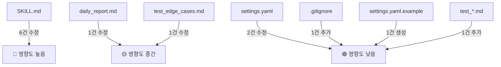

# 🔺 구현물 검증 3-Agent 토론 (구현 구체화 v1)

> **대상**: v5 설계 문서 기반으로 구현된 7개 파일 (settings.yaml, daily_report.md, SKILL.md, sample_sheet_data.md, test_normal/warnings/edge_cases.md)
> **참여자**: Modeling Lead (ML) × Product Lead (PL) × Tech Lead (TL)
> **기본 intensity**: `critical`
> **일시**: 2026-02-16

---

## 검토 대상 파일

| # | 파일 | 역할 |
|---|------|------|
| 1 | `.agent/skills/order-manager/SKILL.md` | 에이전트 스킬 정의 (핵심) |
| 2 | `config/settings.yaml` | 매장/원두/설정 정보 |
| 3 | `templates/daily_report.md` | 리포트 출력 템플릿 |
| 4 | `examples/sample_sheet_data.md` | 샘플 데이터 |
| 5 | `examples/test_normal.md` | 골든 테스트 — 정상 |
| 6 | `examples/test_warnings.md` | 골든 테스트 — 경고 |
| 7 | `examples/test_edge_cases.md` | 골든 테스트 — 엣지 |

---

## Round 1: SKILL.md의 코드 실행 분리 원칙 검증

### 🤖 ML (Modeling Lead)
> "SKILL.md Step 3에서 '산술 연산은 코드 실행(Code Interpreter)으로 수행'이라고 했는데, **어떤 코드를 실행할지가 명시되어 있지 않다.** 에이전트가 Python 코드를 동적으로 생성해서 실행한다는 건가? 그렇다면 코드 생성의 프롬프트 가이드가 필요하다. 단순히 '코드로 하라'는 지시만으로는 환각(Hallucination)에 의한 잘못된 코드 생성 리스크가 있다."

**제안**: SKILL.md에 집계용 코드 스니펫 예시를 포함하거나, 에이전트가 생성할 코드의 **구조 템플릿**을 정의해야 한다.

### 📋 PL (Product Lead)
> "동의한다. 하지만 코드 스니펫을 SKILL.md에 하드코딩하면, 매장/원두가 추가될 때마다 SKILL.md를 수정해야 한다. **코드 구조 템플릿** 수준이 적절하다. 예를 들어 '입력: 행 리스트, 출력: {원두별합산, 매장별합산, 총수량}' 같은 인터페이스만 정의하면 된다."

### ⚙️ TL (Tech Lead)
> "더 근본적인 문제가 있다. Antigravity 에이전트의 코드 실행 환경이 **어떤 런타임인지** 명시되어 있지 않다. Code Interpreter가 Python인지, JavaScript인지, 어떤 라이브러리를 쓸 수 있는지도 없다. 이 상태로는 '코드로 수행하라'는 지시가 **실행 불가능한 요구사항**이 될 수 있다."

### ✅ 합의
- **수정 필요**: SKILL.md Step 3에 코드 실행 인터페이스(입력/출력 명세)와 예시 코드 구조 추가
- **수정 필요**: 에이전트의 코드 실행 환경(런타임, 사용 가능한 라이브러리) 명시

---

## Round 2: 리포트 템플릿의 플레이스홀더 문법

### ⚙️ TL
> "daily_report.md가 Mustache 스타일 (`{{#EACH}}`, `{{#IF}}`) 플레이스홀더를 쓰고 있는데, **이 문법을 해석하는 엔진이 어디에도 없다.** SKILL.md에는 '템플릿의 구조를 절대 변경하지 않고 값만 채워 출력하라'고 되어 있는데, 에이전트가 Mustache 문법을 이해하고 렌더링할 수 있는지 보장이 없다."

**제안**: 두 가지 선택지가 있다.
1. 플레이스홀더를 **실제 예시 형태**로 변경 (에이전트가 패턴 매칭으로 채움)
2. 또는 SKILL.md에서 **리포트 출력 형식을 텍스트로 직접 명시** (템플릿 파일은 참고용)

### 🤖 ML
> "LLM 에이전트는 Mustache를 렌더링하는 게 아니라, 템플릿을 **참고**해서 텍스트를 생성하는 것이다. 실제로는 `{{#EACH}}`를 해석하지 않고, 템플릿과 **동일한 구조의 텍스트를 직접 작성**하는 것이다. 그렇다면 Mustache 문법보다 **완성된 예시 형태**가 에이전트에게 더 명확한 가이드가 된다."

### 📋 PL
> "맞다. 비개발자인 관리자가 템플릿을 보고 구조를 이해할 수 있어야 하는데, `{{#EACH}}` 같은 프로그래밍 문법은 혼란을 줄 수 있다. **완성된 예시 + 주석** 형태가 양쪽 모두에게 좋다. 이미 `implementation_plan.md`에 훌륭한 리포트 예시가 있으니 그것을 템플릿으로 쓰면 된다."

### ✅ 합의
- **수정 필요**: `templates/daily_report.md`를 Mustache 문법 대신 **완성된 예시 형태 + 주석**으로 변경. `implementation_plan.md`의 리포트 예시를 기반으로.

---

## Round 3: settings.yaml의 Sheets URL 보안

### ⚙️ TL
> "settings.yaml에 Google Sheets URL이 평문으로 들어 있다. 이 파일이 Git에 커밋되면 **Sheets URL이 저장소에 노출**된다. Sheets가 'URL을 아는 모든 사용자'로 공유되어 있다면 사실상 누구나 접근 가능해진다. `.gitignore`에 settings.yaml을 추가하거나 URL을 환경변수로 분리해야 한다."

### 📋 PL
> "좋은 지적이지만, 대상 사용자가 '비개발자 로스터리 사장님'이다. 환경변수 설정은 인지 과부하가 크다. 현실적으로는 `.gitignore` 추가 + **settings.yaml.example** (URL 플레이스홀더 포함)을 제공하는 게 적절하다. 그리고 현재 `SHEET_ID_GN` 같은 **플레이스홀더**가 이미 들어 있으니, 실제 ID를 넣기 전까지는 문제없다."

### 🤖 ML
> "보안 관점에서 TL 의견에 동의한다. 다만 현재 시스템의 threat model을 보면, 에이전트가 읽기 전용이고 대상이 원두 주문 데이터(민감도 낮음)이므로, `.gitignore` 추가 정도면 v1에서는 충분하다."

### ✅ 합의
- **수정 필요**: `.gitignore`에 `config/settings.yaml` 추가, `config/settings.yaml.example` 제공
- 환경변수 분리는 v2 로드맵으로 보류

---

## Round 4: 골든 테스트의 검증 엄밀성

### 🤖 ML
> "test_normal.md의 기대 출력을 보면 '총 수량 26.0kg 일치'라고 했는데, 이것은 **핵심 수치 비교** 방식이다. 문제는 에이전트의 출력이 '26kg', '26.0kg', '26.0 kg' 등 다양한 형태로 나올 수 있다는 점이다. **문자열 매칭이 아닌 수치 비교**임을 명시하고, 허용 형식(tolerance)을 정의해야 한다."

### 📋 PL
> "실용적 관점에서, v1에서는 **관리자가 눈으로 확인**하는 것이므로 '26.0kg'이든 '26kg'이든 큰 문제가 아니다. 다만 SKILL.md에 '소수점 첫째 자리까지, kg 단위 항상 표기'라고 했으므로, 테스트에서도 **출력 형식 규칙을 재확인**하는 항목이 있으면 좋다."

### ⚙️ TL
> "향후 자동화 테스트를 하려면, 테스트 파일에 **정규식 또는 수치 추출 규칙**을 명시하는 것이 좋다. 지금은 수동 검증이니 괜찮지만, '검증 기준: 숫자만 추출하여 비교' 같은 한 줄이 있으면 도움이 된다."

### ✅ 합의
- **수정 권장**: 테스트 파일에 검증 방법 명시 — "핵심 수치만 추출하여 비교 (형식 차이 무시)"
- SKILL.md 출력 규칙과 테스트 기대값 형식 일관성 확인

---

## Round 5: SKILL.md의 부분 실패 처리 모순

### ⚙️ TL
> "SKILL.md에 모순이 있다. '가드레일 규칙 4번'에서는 '부분 데이터로 리포트를 생성하지 않음 — 전체 성공 후 출력'이라고 했는데, 바로 뒤에 '단, 시트 접근 불가 매장은 스킵 후 나머지로 처리 가능'이라고 했다. **이건 부분 데이터 리포트 아닌가?** 두 규칙이 충돌한다."

### 📋 PL
> "사용자 관점에서는 1개 매장 접근 불가로 전체 리포트가 안 나오면 더 큰 불편이다. '접근 가능한 매장으로 리포트 생성 + 누락 매장 경고' 방식이 맞다. 가드레일 4번의 표현을 수정해야 한다."

### 🤖 ML
> "동의한다. '부분 데이터' 금지의 원래 의도는 **데이터 파싱 에러로 인한 불완전 집계**를 방지하는 것이었다. 매장 단위 스킵은 '부분 데이터'가 아닌 '스코프 축소'로 봐야 한다. 규칙을 목적에 맞게 재정의해야 한다."

### ✅ 합의
- **수정 필요**: 가드레일 규칙 4번을 명확하게 재작성 — "파싱 에러로 인한 불완전 집계로 리포트를 생성하지 않음. 매장 단위 접근 불가는 해당 매장 스킵 후 나머지로 처리하며, 누락 매장을 ❌ CRITICAL로 명시"

---

## Round 6: 리포트 파일 저장 메커니즘

### ⚙️ TL
> "SKILL.md에 리포트를 `reports/YYYY-MM/daily_report_YYYY-MM-DD_HHMM.md`에 저장하라고 했는데, **Antigravity 에이전트가 파일 시스템에 쓸 수 있는지**가 검증되지 않았다. 에이전트는 대화 형태로 출력하는 것 아닌가? 디렉토리 생성 → 파일 쓰기까지 에이전트가 할 수 있는지 확인이 필요하다."

### 📋 PL
> "Antigravity 에이전트는 파일 시스템 접근 도구가 있으므로 가능하다. 다만 **운영 가이드에 이 부분을 좀 더 명확하게** 설명해야 한다. '리포트가 어디에 저장되었는지' 에이전트가 사용자에게 알려주는 절차가 빠져 있다."

### 🤖 ML
> "리포트 저장 후 에이전트가 '리포트가 `reports/2026-02/daily_report_2026-02-15_1730.md`에 저장되었습니다'라고 **저장 경로를 안내**하는 스텝을 추가해야 한다."

### ✅ 합의
- **수정 필요**: SKILL.md에 Step 6 이후 **리포트 저장 + 경로 안내** 스텝 추가
- 리포트를 대화 창에도 출력하고, 동시에 파일로도 저장하는 것이 UX상 최선

---

## Round 7: test_edge_cases.md의 모순 — 접근 불가 + 부분 리포트

### 📋 PL
> "test_edge_cases.md에서 성수점을 '접근 불가'로 설정하고, 기대 출력에 '처리 매장 수: 2개'라고 했다. 그런데 SKILL.md의 엣지 케이스 표에는 '시트 접근 불가 → 해당 매장만 스킵, 나머지 정상 처리'라고 했고, 가드레일에는 Round 5에서 지적된 모순이 있다. **테스트와 스킬의 동작이 정합적인지** 확인 후 Round 5 합의에 따라 테스트도 업데이트해야 한다."

### ⚙️ TL
> "추가로, test_edge_cases.md에 '필수 컬럼 누락 테스트 데이터'가 있는데, 이것이 강남점의 4번째 행으로 추가되어야 하는 건지 **별도 시나리오인지** 모호하다. 기대 출력에서 '총 주문 건수: 3건'이라고 했지만, 필수 컬럼 누락 행을 포함하면 4행이다 (건너뛰더라도 원본은 4행). 이 구분을 명확히 해야 한다."

### 🤖 ML
> "테스트 설계 원칙으로, '원본 행 수'와 '유효 주문 건수'를 구분해서 기대값을 정의해야 한다. '원본 4행 중 유효 3건 (1건 스킵)' 같은 형태로."

### ✅ 합의
- **수정 필요**: test_edge_cases.md에서 '원본 행 수'와 '유효 주문 건수'를 명확히 구분
- Round 5 합의에 따라 부분 처리 동작과 테스트의 정합성 맞추기

---

## Round 8: settings.yaml에 버전 정보 부재

### 🤖 ML
> "settings.yaml에 **버전 번호**가 없다. 에이전트가 설정을 변경할 수 있고(설정 변경 지원), 변경 전 백업을 만든다고 했는데, 어느 시점의 설정인지 추적할 수 없다. 또한 향후 settings.yaml 스키마가 변경되면 하위 호환성 문제가 생긴다."

### ⚙️ TL
> "좋은 지적이다. `version: 1` 필드를 최상단에 추가하면 향후 스키마 마이그레이션 시 유용하다. 백업 파일명도 `settings.yaml.bak`이 아니라 `settings.yaml.20260216_1400.bak` 같이 **타임스탬프**를 포함해야 여러 번 변경했을 때 히스토리가 보존된다."

### 📋 PL
> "동의한다. 단, 사용자 복잡도는 낮게 유지해야 한다. `version: 1`은 에이전트가 자동 관리하면 되고, 사용자가 직접 수정할 필요 없다. 백업 파일명에 타임스탬프 포함도 에이전트가 자동으로 하면 된다."

### ✅ 합의
- **수정 필요**: settings.yaml 최상단에 `version: 1` 필드 추가
- **수정 필요**: SKILL.md 설정 변경 지원 섹션에서 백업 파일명에 타임스탬프 포함 규칙 명시

---

## Round 9: SKILL.md의 복수일 처리 — 데이터 구분 방법 미정의

### 🤖 ML
> "SKILL.md에 복수일 일괄 처리를 지원한다고 했는데, **각 매장 Sheets에서 해당 날짜의 데이터만 필터링하는 방법**이 명시되지 않았다. Sheets에 여러 날짜의 데이터가 쌓여 있을 때, 에이전트가 '주문일' 컬럼으로 필터링하는 건지, 탭이 날짜별로 분리되어 있는 건지, 아무 설명이 없다."

### 📋 PL
> "현실적으로 매장에서 하나의 탭에 계속 데이터를 쌓아갈 가능성이 높다. 에이전트가 '주문일' 컬럼을 기준으로 해당 날짜만 필터링하는 게 맞다. 이걸 SKILL.md에 명확하게 써야 한다."

### ⚙️ TL
> "그리고 데이터가 수백 행으로 쌓이면 Sheets를 브라우저로 읽는 시간이 급격히 늘어난다. SKILL.md에 **데이터 양이 많을 때의 가이드** (예: 월별 탭 분리 권장, 처리 완료된 데이터 아카이브)를 추가해야 한다."

### ✅ 합의
- **수정 필요**: SKILL.md 복수일 처리 섹션에 '주문일' 컬럼 기준 필터링 방법 명시
- **수정 권장**: 운영 가이드에 '월별 탭 분리' 또는 '처리 완료 데이터 아카이브' 권장사항 추가

---

## Round 10: 전체 파일 정합성 최종 점검

### 📋 PL
> "전체적으로 보면 구현물의 **핵심 구조는 v5 설계에 충실하게 반영**되었다. 데이터 스펙, 교차검증 15개 항목, 경고 3단계, 보안 가이드, 엣지 케이스 처리 등 핵심 항목이 다 있다. 다만 10라운드 토론에서 나온 **수정 필요 항목들을 반영하면** 실제 운영 가능한 수준이 된다."

### ⚙️ TL
> "아키텍처적으로 가장 큰 우려는 **브라우저 기반 Sheets 접근의 불안정성**이다. 하지만 이건 v5에서 이미 '장애 가이드 + v2에서 API 전환 검토'로 결정된 사항이므로, 현재 구현물의 범위 내에서는 적절하다. settings.yaml의 보안(`.gitignore`), 리포트 저장 경로 안내, 부분 실패 처리 규칙 명확화가 실질적으로 중요한 개선점이다."

### 🤖 ML
> "AI 관점에서 가장 중요한 건 **코드 실행 분리의 실행 가능성**이다. 현재 SKILL.md는 '코드로 하라'고 지시하지만 어떤 코드를 어떻게 생성할지는 에이전트에게 맡기고 있다. 이건 품질 격차가 클 수 있다. 집계용 코드 템플릿이 추가되면 **재현성(Reproducibility)**이 크게 향상된다."

### ✅ 최종 합의
이번 구현물은 v5 설계를 충실히 반영한 **좋은 기반 구현**이다. 아래 수정 사항을 반영하면 운영 가능 수준에 도달한다.

---

## 📊 수정 필요 사항 요약

### 🔴 수정 필요 (Must Fix)

| # | 출처 | 대상 파일 | 수정 내용 |
|---|------|----------|----------|
| 1 | R1 | `SKILL.md` | Step 3에 코드 실행 인터페이스(입/출력 명세) 및 예시 코드 구조 추가 |
| 2 | R1 | `SKILL.md` | 에이전트 코드 실행 환경(런타임) 명시 |
| 3 | R2 | `templates/daily_report.md` | Mustache 문법 → **완성된 예시 + 주석** 형태로 변경 |
| 4 | R3 | `.gitignore` | `config/settings.yaml` 추가 |
| 5 | R3 | `config/settings.yaml.example` | URL 플레이스홀더 포함한 예시 파일 생성 |
| 6 | R5 | `SKILL.md` | 가드레일 규칙 4번 — 부분 실패 처리 규칙 명확하게 재작성 |
| 7 | R6 | `SKILL.md` | Step 6 이후 리포트 **파일 저장 + 경로 안내** 스텝 추가 |
| 8 | R7 | `examples/test_edge_cases.md` | '원본 행 수'와 '유효 주문 건수' 구분 명시 |
| 9 | R8 | `config/settings.yaml` | 최상단에 `version: 1` 필드 추가 |
| 10 | R8 | `SKILL.md` | 백업 파일명에 타임스탬프 포함 규칙 명시 |
| 11 | R9 | `SKILL.md` | 복수일 처리 시 '주문일' 컬럼 기준 필터링 방법 명시 |

### 🟡 수정 권장 (Should Fix)

| # | 출처 | 대상 파일 | 수정 내용 |
|---|------|----------|----------|
| 12 | R4 | `examples/test_*.md` | 검증 방법 명시 — "핵심 수치만 추출하여 비교 (형식 차이 무시)" |
| 13 | R9 | `SKILL.md` | 운영 가이드에 '월별 탭 분리' 또는 '처리 완료 데이터 아카이브' 권장 추가 |

---

## 파일별 수정 영향도

> **다음 단계**: 위 수정 사항을 반영한 후, 실제 Google Sheets 테스트 데이터로 UAT를 진행할 것을 권장합니다.
