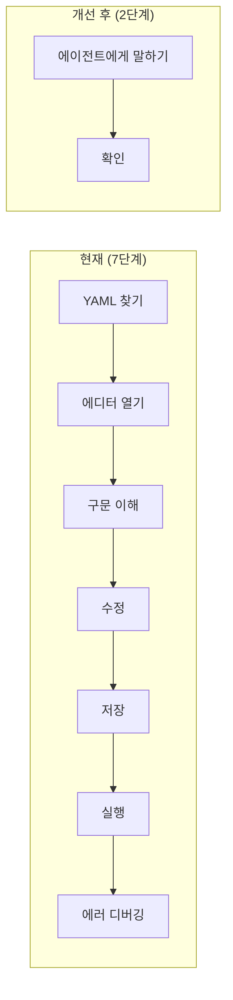

# 🔄 settings.yaml 사용성 토론 — 4자 토론 (10 Rounds)

> **논제**: "사용자가 settings.yaml을 직접 편집하지 않아도 되는 방향으로 사용성을 개선해야 하는가?"
> **참여자**: 🔴 로스터(현장 사용자) × 🟢 Product Lead × 🔵 Tech Lead × 🟡 Modeling Lead
> **현재 상태**: 사용자가 YAML 파일을 직접 열어 매장 URL, 원두 목록, 재고 수치 등을 수정해야 함

---

## Round 1: 문제 제기

### 🔴 로스터 (현장 사용자)
> "솔직히 말할게요. YAML이 뭔지도 모르겠고, 들여쓰기 2칸이 뭐가 중요한지도 모르겠어요. 어제 원두를 하나 추가하려고 했는데 스페이스 하나 잘못 넣어서 에이전트가 통째로 안 돌아갔어요. **로스팅 중에 장갑 끼고 이걸 고칠 수 있을 것 같아요?** 절대 불가능합니다."
>
> **현장 적합성 점수: 3/10**
> - YAML 편집은 로스터의 업무가 아님
> - 오류 1개로 전체 시스템이 중단되는 것은 치명적

### 🟢 Product Lead
> 로스터의 불만은 정당하다. **User Flow Audit** 관점에서 현재 설정 변경 경로를 보면:
>
> `YAML 파일 찾기 → 텍스트 에디터 열기 → 구문 이해 → 수정 → 저장 → 에이전트 실행 → 오류 시 디버깅`
>
> **7단계**다. 이 중 로스터에게 의미 있는 단계는 "수정" 하나뿐이고, 나머지 6단계는 순수한 **인지적 부하(cognitive load)**다. 10x Value Check에서 탈락이다.

### 🔵 Tech Lead
> 동의하지만 한 가지 짚겠다. **현재 설계에는 이미 "에이전트에게 '설정 변경해줘'라고 요청하면 dry-run 후 안전하게 변경합니다"라는 기능이 `order_manager.md`에 명시되어 있다.** 즉, 사용자가 직접 YAML을 편집할 필요가 이미 없는 구조다. 문제는 이 기능이 있다는 것을 사용자가 **모른다**는 것이다.

### 🟡 Modeling Lead
> Tech Lead 말이 맞다. 현재 `order_manager.md`의 "설정 변경 지원" 섹션에 이미 대화형 변경이 설계되어 있다. 하지만 **초기 설정(onboarding)**은 다르다. 처음에 Sheets URL 3개, 원두 3종을 입력하는 것은 대화로 하기엔 비효율적일 수 있다. **초기 설정 vs 운영 중 변경을 분리해서 논의해야** 한다.

---

## Round 2: 초기 설정(Onboarding) 문제

### 🔴 로스터
> "맞아요, 처음 설정할 때가 제일 어려웠어요. '에티오피아 예가체프를 추가해줘'는 할 수 있는데, 처음에 **Google Sheets URL이 뭔지, 어디서 복사하는지**도 몰랐거든요. 그냥 '여기 내 스프레드시트야'라고 브라우저에서 보여주면 안 돼요?"

### 🟢 Product Lead
> 핵심을 짚었다. Onboarding은 두 가지로 나뉜다:
>
> | 단계 | 현재 방식 | 이상적 방식 |
> |------|----------|------------|
> | **최초 설정** | YAML 직접 편집 | 대화형 마법사 ("매장 이름이 뭐예요?") |
> | **운영 중 변경** | YAML 또는 대화 | 대화 전용 ("재고 업데이트해줘") |
>
> **최초 설정을 대화형 온보딩(Conversational Onboarding)**으로 전환하면 YAML을 아예 몰라도 된다.

### 🔵 Tech Lead
> 기술적으로 이건 **에이전트가 settings.yaml을 자동 생성**하는 방식이다. 사용자가 대화로 정보를 주면, 에이전트가 YAML을 만든다. 구현 난이도가 높지 않다. `order_manager.md`의 "설정 변경 지원" 로직을 확장하면 된다.
>
> 하지만 **Google Sheets URL 입력 문제**는 별도다. 로스터가 URL을 복사-붙여넣기하는 것 자체가 장벽이다.

### 🟡 Modeling Lead
> URL 입력을 해결하는 방법:
> 1. **브라우저로 직접 열기**: 사용자가 "내 강남점 시트 보여줄게"라고 하면 브라우저에서 열린 Sheets의 URL을 자동 캡처
> 2. **Google Drive 검색**: "내 드라이브에서 '강남점' 시트 찾아줘" → 에이전트가 Drive를 검색
>
> 방법 1이 현재 Antigravity의 브라우저 도구로 바로 가능하다. 추가 API 연동 없이.

---

## Round 3: YAML 파일의 존폐 논쟁

### 🔴 로스터
> "그러면 YAML 파일 자체를 없앨 수는 없어요? 파일이 있다는 것 자체가 부담이에요."

### 🟢 Product Lead
> **대담한 제안이지만 현실적이지 않다.** 이유:
> 1. 에이전트는 **매 실행마다 설정을 참조**해야 한다. 파일이 없으면 대화 히스토리에서 설정을 매번 추출해야 하는데, 이는 **할루시네이션 리스크**와 **컨텍스트 길이 제한** 문제를 만든다.
> 2. 설정의 **버전 관리와 백업**이 불가능해진다.
>
> YAML은 **에이전트의 내부 저장소**로 유지하되, **사용자에게는 보이지 않는 존재**가 되어야 한다.

### 🔵 Tech Lead
> 동의한다. YAML은 **시스템의 single source of truth**로서 반드시 필요하다. 하지만 사용자 관점에서는:
>
> ```
> Before: 사용자 ←→ YAML ←→ 에이전트
> After:  사용자 ←→ 에이전트 ←→ YAML (사용자 접근 불필요)
> ```
>
> 핵심 변경: **YAML은 유지하되, 사용자의 접점에서 제거**한다.

### 🟡 Modeling Lead
> 정확하다. LLM 관점에서 YAML은 **구조화된 설정 저장소**로 최적이다. JSON보다 가독성이 좋고, 에이전트가 읽기/쓰기에 안정적이다. 다만 다음을 보장해야 한다:
> - 에이전트가 YAML을 수정할 때 **구문 오류를 만들지 않도록** 검증 로직 필요
> - 수정 전 **반드시 백업** (이미 설계에 포함됨)

---

## Round 4: 구체적 대안 설계

### 🟢 Product Lead
> 정리하면 세 가지 시나리오를 커버해야 한다:
>
> | 시나리오 | 현재 | 개선안 |
> |---------|------|--------|
> | **A. 최초 설정** | YAML 직접 편집 | 대화형 온보딩 마법사 |
> | **B. 운영 중 변경** | YAML 또는 대화 | 대화 전용 |
> | **C. 재고 업데이트** | YAML `stock_kg` 수정 | "재고 업데이트해줘" 대화 |
>
> **User Flow (개선 후)**:
> ```
> 사용자: "주문 관리 시작할게"
> 에이전트: "매장 정보를 알려주세요. 매장 이름부터 시작할까요?"
> 사용자: "강남점, 홍대점, 성수점"
> 에이전트: "각 매장의 Google Sheets를 브라우저에서 열어주세요. 열면 자동으로 URL을 가져올게요."
> (... 대화 진행 ...)
> 에이전트: "설정이 완료되었습니다. '오늘 주문 정리해줘'로 시작하세요."
> ```

### 🔴 로스터
> "이거요! 이게 제가 원하는 거예요! 파일 같은 건 전혀 안 건드리고, 대화만으로 다 되는 거잖아요. **이해할 수 없는 부분: 0개.** 현장 적합성이 확 올라갑니다."
>
> **현장 적합성 점수: 8/10** (초기 설정도 대화형이면)

### 🔵 Tech Lead
> 구현 관점에서 필요한 변경:
> 1. `order_manager.md`에 **온보딩 플로우(Step -1)** 추가: settings.yaml이 없거나 빈 상태일 때 자동 진입
> 2. 브라우저에서 열린 Sheets URL 자동 캡처 로직
> 3. 대화로 받은 정보 → YAML 생성 로직 (이건 기존 "설정 변경 지원"의 확장)
>
> **리스크**: 브라우저 도구로 URL을 캡처할 때, 사용자가 여러 탭을 열어둔 경우 잘못된 URL을 가져올 수 있다.

### 🟡 Modeling Lead
> URL 캡처 리스크 해결:
> - 캡처 후 **확인 단계** 추가: "이 URL이 강남점 시트가 맞나요? [URL 표시]"
> - 사용자 승인 없이 자동 저장하지 않음
>
> 이건 현재 설계의 "dry-run" 원칙과 일관성이 있다.

---

## Round 5: 재고 업데이트 시나리오

### 🔴 로스터
> "재고 업데이트가 제일 빈번해요. 생두가 들어올 때마다 해야 하는데, 지금은 YAML 열어서 `stock_kg: 30`을 `stock_kg: 50`으로 바꿔야 하잖아요. **이걸 로스팅 끝나고 땀 흘리면서 할 수는 없어요.**"

### 🟢 Product Lead
> 재고 업데이트 UX는 가장 빈번한 사용 패턴이니 **최적화 1순위**다:
>
> ```
> 사용자: "에티오피아 20kg 들어왔어"
> 에이전트: "에티오피아 예가체프 재고를 30kg → 50kg으로 업데이트할까요?"
> 사용자: "응"
> 에이전트: "✅ 업데이트 완료. (settings.yaml 자동 백업됨)"
> ```
>
> **2턴 완료.** YAML 편집의 7단계 대비 극적인 개선이다.

### 🔵 Tech Lead
> 이미 `order_manager.md`의 "설정 변경 지원" 섹션에 이 플로우가 설계되어 있다. 추가 구현이 거의 필요 없다. 다만 한 가지:
>
> **재고는 단방향이 아니다.** 주문 처리 후 재고가 자동 차감되어야 하지 않나? 현재는 수동 업데이트만 설계되어 있다.

### 🟡 Modeling Lead
> ⚠️ **자동 재고 차감은 위험하다.** 이유:
> 1. 로스팅 전 생두 재고 vs 로스팅 후 원두는 다르다 (로스팅 감량률 ~15-20%)
> 2. 주문이 접수되었다고 해서 바로 재고가 줄어드는 것은 물리적 현실과 맞지 않다
> 3. 수동 차감이 맞다. 에이전트는 **"재고 부족 경고"만** 내고, 실제 차감은 로스터가 판단
>
> 현재 설계가 올바르다.

### 🔴 로스터
> "맞아요. 재고 자동 차감은 안 돼요. 생두 30kg이 로스팅하면 24-25kg밖에 안 나오니까. 내가 직접 '에티오피아 5kg 썼어'라고 말하는 게 맞아요."

---

## Round 6: 원두/매장 추가·삭제 시나리오

### 🟢 Product Lead
> 원두 추가 시나리오:
> ```
> 사용자: "에티오피아 하라를 원두 목록에 추가해줘. 코드는 ETH-HAR, 재고 20kg, 단가 28000원"
> 에이전트: "[미리보기] 다음을 추가합니다:
>   - 에티오피아 하라 (Ethiopia Harrar) / ETH-HAR / 20kg / ₩28,000
>   진행할까요?"
> 사용자: "응"
> 에이전트: "✅ 추가 완료."
> ```
>
> 이것도 이미 설계에 포함되어 있다. **문제는 "이 기능이 있다"는 것을 사용자가 모른다는 것**.

### 🔴 로스터
> "아, 이게 된다고요? 저는 매번 파일을 열어서 수정했는데... **어디서도 그런 안내를 못 봤어요.**"

### 🔵 Tech Lead
> 이것이 핵심 이슈다. 기능은 있는데 **디스커버러빌리티(discoverability)가 0**이다. 해결책:
> 1. 에이전트 **첫 실행 시** 가용 명령어 목록을 안내
> 2. settings.yaml 파일 상단 주석에 "이 파일을 직접 편집하지 마세요. 에이전트에게 말로 요청하세요."를 **더 강조**
> 3. 에이전트가 YAML 파일 수정을 감지하면 "직접 편집하셨네요. 다음부터는 저에게 말씀해주세요" 안내

### 🟡 Modeling Lead
> 2번과 3번에 동의한다. 그리고 추가로:
> 4. `/order-report` 스킬 실행 시 settings.yaml의 `last_modified` 타임스탬프를 체크하여, 에이전트 외부에서 수정된 경우 경고를 표시하는 것도 좋다.
>
> 이렇게 하면 사용자가 점차 **대화형 변경에 학습(nudge)**되는 효과가 있다.

---

## Round 7: 온보딩 플로우 구체화

### 🟡 Modeling Lead
> 온보딩 프롬프트 설계를 구체화하자. settings.yaml이 존재하지 않거나 `stores: []`가 빈 배열일 때:
>
> ```
> 에이전트: "원두 주문 관리 시스템을 처음 설정합니다. 몇 가지만 알려주세요.
>   1. 로스터리 이름
>   2. 매장 수와 이름
>   3. 각 매장의 Google Sheets (브라우저에서 열어주시면 자동으로 가져올게요)
>   4. 취급 원두 목록
>   시작할까요?"
> ```
>
> 단계별로 정보를 수집하고, 마지막에 전체 미리보기를 보여준 후 확인을 받는다.

### 🔵 Tech Lead
> 구현 상 주의점:
> - **settings.yaml이 이미 존재하면 온보딩을 스킵**해야 한다
> - 기존 settings.yaml이 있으나 일부 필수 정보가 빠진 경우(예: stores가 빈 배열), **부분 온보딩**도 지원
> - 온보딩 중 사용자가 이탈(대화 종료)해도 **중간 저장**이 가능해야 한다 → settings.yaml에 `onboarding_complete: false` 플래그 추가

### 🟢 Product Lead
> `onboarding_complete` 플래그보다는 **필수 필드 존재 여부로 판단**하는 게 깔끔하다. `stores` 배열에 최소 1개 매장 + `beans` 배열에 최소 1개 원두가 있으면 온보딩 완료로 간주.
>
> 별도 플래그를 추가하면 YAML의 복잡도만 늘어난다.

### 🔴 로스터
> "중간에 끊겨도 괜찮다는 거죠? 로스팅 불러 가야 할 때 '잠깐 나갔다 올게' 하고 나중에 이어할 수 있으면 완벽해요."

---

## Round 8: settings.yaml 주석 개선

### 🔵 Tech Lead
> 당장 가장 적은 노력으로 사용성을 크게 개선하는 방법은 **settings.yaml 파일 자체의 메시지를 바꾸는 것**이다:
>
> **현재 (개발자 관점)**:
> ```yaml
> # 이 파일은 에이전트(order-manager 스킬)가 참조하는 유일한 설정 파일입니다.
> # 수정 시 YAML 구문에 주의하세요. 들여쓰기는 스페이스 2칸입니다.
> ```
>
> **개선안 (사용자 관점)**:
> ```yaml
> # ⚠️ 이 파일을 직접 수정하지 마세요!
> # 설정을 변경하고 싶으면 에이전트에게 말로 요청하세요.
> # 예: "강남점 Sheets URL 바꿔줘", "에티오피아 하라 추가해줘", "재고 업데이트해줘"
> ```

### 🔴 로스터
> "이거면 파일을 실수로 열더라도 '아, 건드리면 안 되는구나'를 바로 알 수 있어요. 좋아요."

### 🟢 Product Lead
> 좋다. 그리고 **settings.yaml.example 파일과의 관계도 정리**해야 한다:
> - `settings.yaml.example` → Git에 커밋, **개발자/관리자 참고용** (스키마 문서 역할)
> - `settings.yaml` → Git에서 제외, **에이전트가 자동 생성·관리** (사용자 접근 불필요)
>
> 이렇게 역할을 명확히 분리하면 된다.

### 🟡 Modeling Lead
> 추가로, `order_manager.md`의 **운영 가이드 섹션에서 "YAML 편집 시 주의" 문구를 삭제**하고, "설정 변경은 에이전트에게 요청" 문구로 교체해야 한다. 현재 instruction이 사용자에게 YAML 편집을 유도하는 듯한 인상을 주고 있다.

---

## Round 9: 실행 가능한 변경 사항 합의

### 🟢 Product Lead
> 토론 결과를 **당장 적용 가능한 것**과 **향후 로드맵**으로 분류하자:
>
> **✅ 즉시 적용 (코드 변경 없이, instruction 수정만)**
>
> | # | 변경 | 영향 파일 |
> |---|------|----------|
> | U1 | settings.yaml 상단 주석: "직접 수정 금지" 강조 | `settings.yaml`, `settings.yaml.example` |
> | U2 | order_manager.md: "YAML 편집 주의" → "에이전트에게 요청" 메시지 변경 | `order_manager.md` |
> | U3 | order_manager.md: 대화형 설정 변경 예시 추가 (재고, 원두, 매장) | `order_manager.md` |
> | U4 | order_manager.md: 첫 실행 시 가용 명령어 안내 가이드 추가 | `order_manager.md` |
>
> **🔜 다음 버전 (온보딩 마법사)**
>
> | # | 변경 | 설명 |
> |---|------|------|
> | U5 | 온보딩 플로우 (Step -1) | settings.yaml 없을 때 대화형 초기 설정 |
> | U6 | 브라우저 URL 자동 캡처 | 사용자가 브라우저에서 Sheets를 열면 URL 자동 수집 |
> | U7 | 외부 편집 감지 경고 | 에이전트 외부에서 YAML 수정 시 안내 메시지 |

### 🔵 Tech Lead
> U1~U4는 **instruction 파일 수정만으로 가능**하므로 즉시 적용에 동의한다. U5~U7은 에이전트 동작 로직 변경이 필요하므로 다음 버전으로 적절하다.
>
> U5(온보딩)에 대한 기술 의견: settings.yaml을 **에이전트가 자동으로 생성**하려면 YAML 출력의 안정성이 보장되어야 한다. Python `yaml.dump()`를 코드 실행으로 처리하는 것이 LLM이 직접 YAML 문자열을 생성하는 것보다 안전하다.

### 🟡 Modeling Lead
> U5 구현 방법에 동의한다. 추가로 에이전트가 YAML을 생성할 때:
> 1. Python `yaml.safe_dump()`로 생성
> 2. 생성 후 다시 `yaml.safe_load()`로 검증 (round-trip 테스트)
> 3. 검증 통과 시에만 저장
>
> 이것은 "설정 변경 지원"에도 동일하게 적용해야 한다.

### 🔴 로스터
> "결론적으로: 나는 YAML이라는 단어를 앞으로 볼 필요가 없어야 해요. 그게 제 요구사항이에요."

---

## Round 10: 최종 합의 및 로스터 스코어카드

### 🔴 로스터 — 최종 스코어카드

| 항목 | 현재 점수 | 개선 후 (U1~U4) | 완전 구현 후 (U1~U7) |
|------|----------|---------------|-------------------|
| **현장 적합성** | 3/10 | **6/10** | **9/10** |
| **이해할 수 없는 부분** | YAML 전체, 들여쓰기, 코드 | YAML(보이지 않음) | 없음 |
| **로스터의 역제안** | - | "파일 열지 마세요" 경고 | "시작할게" 한마디로 온보딩 |

### 🟢 Product Lead — User Flow 비교



**KPI**: 설정 변경 시 사용자 조작 단계 7 → 2 (71% 감소)

### 🔵 Tech Lead — 기술 변경 요약

| 변경 | 리스크 | 난이도 |
|------|--------|--------|
| U1~U4 (주석·instruction 수정) | 없음 | ⬇️ 매우 낮음 |
| U5 (온보딩 마법사) | YAML 생성 구문 오류 → Python round-trip 검증으로 해소 | ⬇️ 낮음 |
| U6 (URL 자동 캡처) | 잘못된 탭 캡처 → 확인 단계로 해소 | ⬇️ 낮음 |
| U7 (외부 편집 감지) | false positive → modified 타임스탬프 비교로 해소 | ⬇️ 낮음 |

### 🟡 Modeling Lead — AI 안전성 체크

- ✅ YAML round-trip 검증으로 구문 오류 방지
- ✅ dry-run + 사용자 확인으로 데이터 무결성 유지
- ✅ 백업 정책 유지 (타임스탬프 포함 .bak)
- ⚠️ 온보딩 프롬프트에서 **할루시네이션 방지**: 에이전트가 설정값을 "추측"하지 않도록 모든 값을 사용자에게 명시적으로 확인

---

## 📋 최종 합의 사항

### Must Fix (즉시 적용)
| # | 합의 | 파일 |
|---|------|------|
| **U1** | settings.yaml 주석을 "⚠️ 직접 수정 금지" + 대화형 변경 예시로 교체 | `settings.yaml`, `settings.yaml.example` |
| **U2** | order_manager.md의 운영 팁에서 "YAML 편집 주의" 문구 → "에이전트에게 요청" 으로 변경 | `order_manager.md` |
| **U3** | order_manager.md에 대화형 설정 변경 예시 3종 추가 (재고, 원두, 매장) | `order_manager.md` |
| **U4** | order_manager.md에 첫 실행 시 명령어 안내 문구 추가 | `order_manager.md` |

### Should Fix (다음 버전)
| # | 합의 | 설명 |
|---|------|------|
| **U5** | 대화형 온보딩 마법사 (Step -1) | settings.yaml 없을 때 자동 진입, Python round-trip 검증 |
| **U6** | 브라우저 URL 자동 캡처 | Sheets 열기 → URL 자동 수집 + 확인 |
| **U7** | 외부 편집 감지 경고 | 에이전트 외부에서 YAML 수정 감지 시 대화형 변경 안내 |
